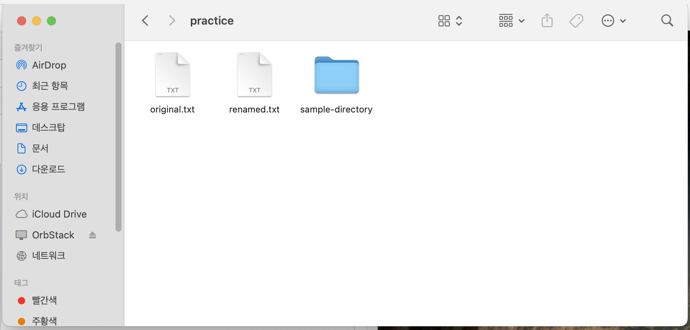
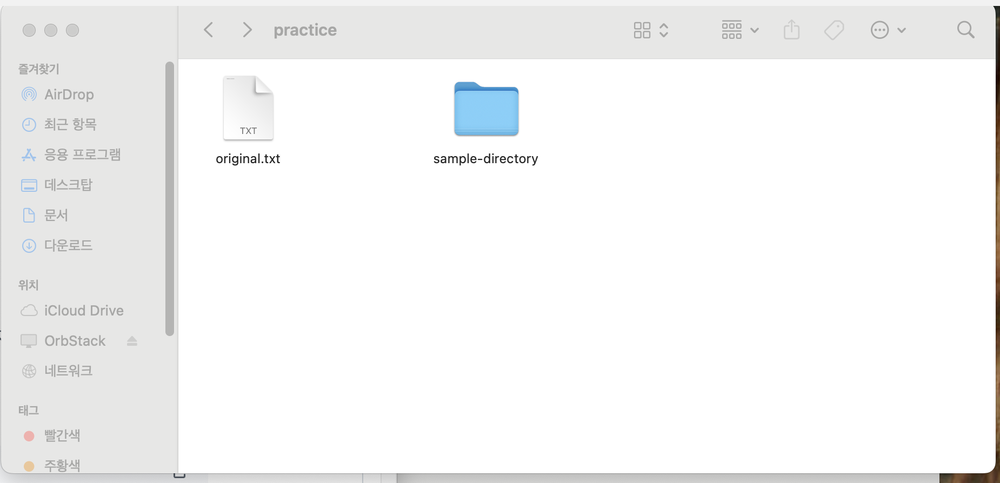
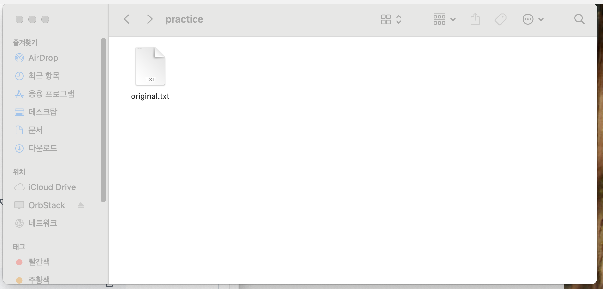

# Codyssey E1-1 Mission

# 내 컴퓨터에 개발자용 작업실 꾸미기

> 터미널, Git/GitHub, Docker를 직접 사용하여 재현 가능한 개발 워크스테이션을 구축하고, 모든 수행 과정과 검증 결과를 기록합니다.

| 항목 | 내용 |
|---|---|
| 분야 | 입학연수 |
| 구분 | 개발 입문 |
| 학습 시간 | 40시간 |
| 제출 방식 | GitHub Repository |
| 진행 상태 | 실습 진행 중 |

---

## 1. 프로젝트 개요

개발은 코드를 작성하는 순간이 아니라 코드를 실행하고 관리할 환경을 준비하는 순간부터 시작합니다. 이번 미션에서는 Linux CLI로 파일과 디렉터리를 관리하고 권한을 설정한 뒤, Git과 GitHub로 변경 이력을 관리합니다. 또한 Docker를 이용해 같은 서비스를 여러 번 실행해도 동일하게 재현되는 컨테이너 환경을 구축합니다.

### 학습 목표

- 절대 경로와 상대 경로의 차이 설명하기
- 파일과 디렉터리의 `r`, `w`, `x` 권한 이해하기
- `755`, `644`와 같은 숫자 권한 해석하기
- Git과 GitHub의 역할 구분하기
- Docker 이미지와 컨테이너의 차이 설명하기
- Dockerfile로 커스텀 이미지 만들기
- 포트 매핑이 필요한 이유 설명하기
- 바인드 마운트와 볼륨의 차이 설명하기
- 명령과 결과를 기록하여 다른 사람이 재현할 수 있는 문서 만들기

### 서울캠퍼스 환경 안내

서울캠퍼스에서는 시스템 보안 정책에 따라 `sudo` 사용이 제한될 수 있습니다. 이 경우 Docker Desktop 대신 OrbStack을 실행하여 Docker 엔진을 구동합니다. OrbStack 실행 후에도 터미널에서는 `docker run`, `docker ps`, `docker build` 등 기존 Docker 명령어를 동일하게 사용할 수 있습니다.

---

## 2. 실행 환경

> 아래 표의 `TODO`를 본인의 실제 확인 결과로 교체합니다.

| 항목 | 실제 환경 |
|---|---|
| OS | macOS 15.7.4 (Build 24G517) |
| Shell | zsh (`/bin/zsh`) |
| Terminal | macOS Terminal |
| Editor | Visual Studio Code |
| Container Runtime | OrbStack |
| Docker Version | Docker 28.5.2 (build ecc6942) |
| Git Version | Git 2.53.0 |

### 환경 확인 명령

```bash
sw_vers
echo $SHELL
git --version
docker --version
docker info
```

<details>
<summary><strong>실제 실행 결과 기록</strong></summary>

```console
$ sw_vers
ProductName:            macOS
ProductVersion:         15.7.4
BuildVersion:           24G517

$ echo $SHELL
/bin/zsh

$ git --version
git version 2.53.0

$ docker --version
Docker version 28.5.2, build ecc6942

$ docker info
Client:
 Version:    28.5.2
 Context:    orbstack
 Debug Mode: false
```

처음에 `sw vers`를 입력했을 때 명령어를 찾을 수 없다는 오류가 발생했습니다. macOS 버전 확인 명령은 띄어쓰기 없이 밑줄을 사용한 `sw_vers`이므로 명령어를 수정하여 정상적으로 확인했습니다.

증거 이미지:


</details>

---

## 3. 수행 체크리스트

> 실제 수행하고 증거까지 기록한 항목만 `[x]`로 변경합니다.

- [x] 실행 환경 확인
- [x] 터미널 기본 조작 및 작업 디렉터리 구성
- [ ] 파일 권한 변경 실습
- [ ] 디렉터리 권한 변경 실습
- [x] Git 사용자 정보 및 기본 브랜치 설정
- [ ] GitHub 저장소 및 VSCode 연동
- [ ] Docker 설치 및 데몬 점검
- [ ] `hello-world` 실행
- [ ] Ubuntu 컨테이너 실행 및 내부 진입
- [ ] 이미지·컨테이너 운영 명령 실행
- [ ] Dockerfile 작성 및 커스텀 이미지 빌드
- [ ] 웹 서버 컨테이너 실행
- [ ] 포트 매핑 접속 확인
- [ ] 바인드 마운트 변경 반영 확인
- [ ] Docker 볼륨 영속성 확인
- [ ] 트러블슈팅 2건 이상 기록
- [ ] 민감정보 노출 여부 최종 점검

---

## 4. 핵심 개념 정리

<details>
<summary><strong>터미널, CLI, Shell</strong></summary>

- **CLI**: 마우스 대신 명령어를 입력하여 컴퓨터를 제어하는 방식입니다.
- **Terminal**: 사용자가 명령어를 입력하고 결과를 확인하는 프로그램입니다.
- **Shell**: 입력한 명령어를 해석하여 운영체제에 전달하는 프로그램입니다.

```text
사용자 → Terminal → Shell → Operating System → 실행 결과
```

</details>

<details>
<summary><strong>절대 경로와 상대 경로</strong></summary>

- **절대 경로**: 최상위 위치부터 파일까지 전체 경로를 작성합니다.
- **상대 경로**: 현재 위치를 기준으로 경로를 작성합니다.

```text
절대 경로: /Users/user/codyssey/app/index.html
상대 경로: ./app/index.html
```

| 기호 | 의미 |
|---|---|
| `.` | 현재 디렉터리 |
| `..` | 상위 디렉터리 |
| `/` | 최상위 경로 |
| `~` | 현재 사용자의 홈 디렉터리 |

</details>

<details>
<summary><strong>Linux 파일 권한</strong></summary>

| 권한 | 파일에서의 의미 | 디렉터리에서의 의미 | 숫자 |
|---|---|---|---:|
| `r` | 파일 내용 읽기 | 목록 확인 | 4 |
| `w` | 파일 내용 수정 | 파일 생성·삭제 | 2 |
| `x` | 파일 실행 | 디렉터리 내부 접근 | 1 |

```text
rwx r-x r-x
│   │   └─ 기타 사용자
│   └───── 그룹
└───────── 소유자
```

- `755` = `rwxr-xr-x`
- `644` = `rw-r--r--`

</details>

<details>
<summary><strong>Git과 GitHub</strong></summary>

| 구분 | Git | GitHub |
|---|---|---|
| 역할 | 로컬 파일의 버전 관리 | 원격 저장소 공유 및 협업 |
| 위치 | 내 컴퓨터 | 온라인 서버 |
| 주요 명령/기능 | add, commit, branch | push, pull request, issue |

</details>

<details>
<summary><strong>Docker 핵심 구조</strong></summary>

- **Dockerfile**: 이미지를 만드는 절차를 적은 설정 파일
- **Image**: 컨테이너 실행에 필요한 파일과 설정을 묶은 읽기 전용 설계도
- **Container**: 이미지를 기반으로 실제 실행된 독립 환경
- **Port Mapping**: 호스트 포트와 컨테이너 포트를 연결하는 기능
- **Bind Mount**: 호스트의 실제 파일·디렉터리를 컨테이너와 직접 연결하는 방식
- **Volume**: Docker가 관리하며 컨테이너 삭제 후에도 데이터를 유지하는 저장 공간

```text
Dockerfile → Image 빌드 → Container 실행
```

</details>

---

## 5. 터미널 기본 조작 실습

### 5.1 실습 목표

현재 위치 확인, 숨김 파일을 포함한 목록 확인, 이동, 생성, 복사, 이름 변경, 내용 확인, 삭제를 모두 터미널에서 수행합니다.

### 5.2 실습 명령

```bash
pwd
mkdir -p ~/codyssey/practice
cd ~/codyssey/practice
ls -la
touch original.txt
echo "Codyssey CLI practice" > original.txt
cat original.txt
cp original.txt copied.txt
mv copied.txt renamed.txt
mkdir sample-directory
ls -la
rm renamed.txt
rmdir sample-directory
ls -la
```

### 5.3 명령어 설명

| 실습 명령 | 기능 | 이 실습에서 확인하는 내용 |
|---|---|---|
| `pwd` | 현재 작업 중인 디렉터리의 절대 경로 출력 | 명령을 실행할 현재 위치 확인 |
| `mkdir -p ~/codyssey/practice` | 중간 경로를 포함하여 디렉터리 생성 | 홈 디렉터리 아래에 실습 공간 구성 |
| `cd ~/codyssey/practice` | 지정한 디렉터리로 이동 | 생성한 실습 디렉터리를 현재 위치로 변경 |
| `ls -la` | 숨김 파일을 포함한 전체 목록을 자세히 출력 | 파일명, 권한, 소유자, 크기 등을 함께 확인 |
| `touch original.txt` | 내용이 없는 파일 생성 | 새 텍스트 파일 생성 |
| `echo "Codyssey CLI practice" > original.txt` | 문자열을 파일에 기록 | 표준 출력과 출력 리다이렉션 사용 |
| `cat original.txt` | 파일 내용을 터미널에 출력 | 기록한 문자열이 저장되었는지 확인 |
| `cp original.txt copied.txt` | 원본 파일을 새 이름으로 복사 | 원본을 유지하면서 동일한 사본 생성 |
| `mv copied.txt renamed.txt` | 파일 이동 또는 이름 변경 | 같은 디렉터리에서 파일 이름 변경 |
| `mkdir sample-directory` | 새 디렉터리 생성 | 빈 디렉터리 생성 |
| `rm renamed.txt` | 파일 삭제 | 복사 후 이름을 변경한 파일 삭제 |
| `rmdir sample-directory` | 비어 있는 디렉터리 삭제 | 빈 디렉터리 삭제 조건 확인 |

### 5.4 기호와 옵션 설명

| 기호 또는 옵션 | 의미 |
|---|---|
| `~` | 현재 사용자의 홈 디렉터리 |
| `-p` | 상위 디렉터리가 없어도 필요한 경로를 함께 생성하고, 이미 존재해도 오류를 내지 않음 |
| `-l` | 파일 권한, 소유자, 크기, 수정 시각 등을 긴 형식으로 표시 |
| `-a` | 이름이 `.`으로 시작하는 숨김 파일까지 모두 표시 |
| `>` | 왼쪽 명령의 출력을 오른쪽 파일에 덮어쓰기 |

> `rm`은 파일을 삭제하고, `rmdir`은 **비어 있는 디렉터리만** 삭제합니다. 터미널에서 삭제한 파일은 일반적으로 휴지통으로 이동하지 않으므로 삭제 전 파일명을 반드시 확인합니다.

#### `ls -la` 결과 읽는 방법

실습에서 출력된 한 줄을 예로 살펴봅니다.

```text
drwxr-xr-x  2 [사용자명]  [그룹명]  64  8  4 16:46 .
```

| 출력 부분 | 의미 |
|---|---|
| `d` | 디렉터리임을 의미합니다. 일반 파일은 `-`로 표시됩니다. |
| `rwxr-xr-x` | 소유자·그룹·기타 사용자의 권한입니다. |
| `2` | 이 항목을 가리키는 하드 링크 수입니다. |
| `[사용자명]` | 이 파일 또는 디렉터리의 소유자입니다. |
| `[그룹명]` | 이 항목이 소속된 그룹입니다. |
| `64` | 파일 또는 디렉터리 항목의 크기를 바이트 단위로 표시합니다. |
| `8 4 16:46` | 마지막 수정 날짜와 시각입니다. |
| `.` | 현재 디렉터리 자체를 뜻합니다. |

`ls -a`를 사용하면 다음과 같은 특별한 항목도 표시됩니다.

| 항목 | 의미 |
|---|---|
| `.` | 현재 디렉터리 |
| `..` | 한 단계 위의 상위 디렉터리 |

따라서 처음 실행한 `ls -la`에서 `.`과 `..`만 보였다는 것은 `practice` 디렉터리 안에 아직 일반 파일이 없었다는 의미입니다.

### 5.5 실습 흐름

```text
현재 위치 확인
→ 실습 디렉터리 생성 및 이동
→ 파일 생성 및 내용 기록
→ 파일 복사 및 이름 변경
→ 파일과 디렉터리 삭제
→ 최종 목록 확인
```

### 5.6 실제 실행 결과

<details>
<summary><strong>실제 실행 결과 기록</strong></summary>

```console
$ pwd
/Users/[사용자명]

$ mkdir -p
usage: mkdir [-pv] [-m mode] directory_name ...

$ mkdir -p~/codyssey/practice
mkdir: illegal option -- ~
usage: mkdir [-pv] [-m mode] directory_name ...

$ mkdir -p ~/codyssey/practice

$ cd ~codysseypractice
zsh: no such user or named directory: codysseypractice

$ cd ~/codyssey/practice
$ ls -la
total 0
drwxr-xr-x  2 [사용자명]  [사용자명]  64  8  4 16:46 .
drwxr-xr-x  3 [사용자명]  [사용자명]  96  8  4 16:46 ..

$ touch original.txt
$ echo "Codyssey CLI practice" > original.txt
$ cat original.txt
Codyssey CLI practice

$ cp original.txt coide.txt
$ mv coide.txt renamed.txt
$ mkdir sample-directory
$ rm renamed.txt

$ rmdir samplre-directory
rmdir: samplre-directory: No such file or directory

$ rmdir sample-directory
```

### 단계별 화면

실습 디렉터리 생성:


`original.txt` 생성, 파일 복사·이름 변경 및 `sample-directory` 생성:



`rm renamed.txt` 실행 후 `renamed.txt` 삭제:



`rmdir sample-directory` 실행 후 빈 디렉터리 삭제:



확인한 내용:

1. `pwd`를 통해 홈 디렉터리의 절대 경로를 확인했습니다.
2. `mkdir -p` 뒤에는 생성할 경로가 반드시 필요하며, 옵션과 경로 사이에도 공백이 필요하다는 것을 확인했습니다.
3. `~`와 디렉터리 이름을 붙여 쓴 `~codysseypractice`는 특정 사용자 홈을 찾는 형태로 해석되므로, `~/codyssey/practice`처럼 슬래시로 경로를 구분해야 합니다.
4. `touch`로 빈 파일을 만들고 `echo ... > 파일명`으로 내용을 기록한 뒤, `cat`으로 저장 결과를 확인했습니다.
5. `cp`로 만든 `coide.txt`를 `mv`로 `renamed.txt`로 변경했습니다. 예시의 `copied.txt`와 이름은 다르지만 복사와 이름 변경 결과는 동일합니다.
6. `rm`으로 파일을 삭제한 뒤 Finder에서 `renamed.txt`가 사라진 것을 확인했습니다.
7. `samplre-directory`처럼 이름을 잘못 입력하면 `No such file or directory` 오류가 발생하며, 정확한 이름인 `sample-directory`로 수정하자 정상적으로 삭제되었습니다.
8. 마지막에는 `original.txt`만 남아 파일과 빈 디렉터리 삭제가 모두 완료된 것을 확인했습니다.

</details>

---

## 6. 파일 및 디렉터리 권한 실습

### 6.1 파일 권한 변경

```bash
touch permission-file.sh
ls -l permission-file.sh
chmod 755 permission-file.sh
ls -l permission-file.sh
chmod 644 permission-file.sh
ls -l permission-file.sh
```

### 6.2 디렉터리 권한 변경

```bash
mkdir permission-directory
ls -ld permission-directory
chmod 755 permission-directory
ls -ld permission-directory
chmod 700 permission-directory
ls -ld permission-directory
```

### 6.3 `ls -l`과 `ls -ld`의 차이

| 명령 | 확인 대상 | 사용 목적 |
|---|---|---|
| `ls -l 파일명` | 지정한 파일의 상세 정보 | 파일 권한과 소유자 확인 |
| `ls -l 디렉터리명` | 디렉터리 **안에 들어 있는 항목** | 디렉터리 내부 목록 확인 |
| `ls -ld 디렉터리명` | 디렉터리 **자체의 상세 정보** | 디렉터리 자체 권한 확인 |

여기서 `-d`는 디렉터리 내부로 들어가 목록을 보여주는 대신, 지정한 디렉터리 자체를 하나의 항목으로 표시하라는 옵션입니다.

```text
ls -l permission-directory
└─ permission-directory 안에 있는 파일 목록 확인

ls -ld permission-directory
└─ permission-directory 자체의 권한 확인
```

권한 실습에서는 디렉터리 자체의 권한이 어떻게 바뀌는지 비교해야 하므로 `ls -ld permission-directory`를 사용합니다.

<details>
<summary><strong>변경 전후 결과 기록</strong></summary>

파일 권한:

```console
# TODO: 변경 전 → 755 → 644 출력 결과
```

디렉터리 권한:

```console
# TODO: 변경 전 → 755 → 700 출력 결과
```

```markdown
<!--  -->
```

해석:

> TODO: 실제 출력된 권한을 `소유자 / 그룹 / 기타 사용자`로 나누어 설명합니다.

</details>

---

## 7. Git 설정 및 GitHub·VSCode 연동

### 7.1 Git 설정

```bash
git config --global user.name "본인 이름"
git config --global user.email "본인 이메일"
git config --global init.defaultBranch main
git config --list
```

> 공개 README에는 이메일 전체를 노출하지 말고 필요한 경우 일부를 마스킹합니다.

### 7.2 저장소 연결 확인

```bash
git status
git branch --show-current
git remote -v
```

### 7.3 명령어와 옵션 설명

| 명령 | 의미 |
|---|---|
| `git config --global` | 현재 사용자의 모든 Git 저장소에 공통 설정 적용 |
| `git config --global --get 항목` | 전체 목록 대신 지정한 설정값 하나만 확인 |
| `git status` | 현재 브랜치와 작업 파일의 변경 상태 확인 |
| `git branch --show-current` | 현재 체크아웃한 브랜치 이름 출력 |
| `git remote -v` | 원격 저장소 이름과 fetch·push 주소 확인 |
| `git fetch origin` | 원격 변경 이력만 내려받고 로컬 파일에는 바로 합치지 않음 |
| `git log --left-right HEAD...origin/main` | 로컬과 원격 중 어느 쪽에만 존재하는 커밋인지 비교 |
| `git branch backup/...` | 현재 커밋을 가리키는 복구용 브랜치 생성 |
| `git reset --hard origin/main` | 로컬 브랜치와 작업 파일을 원격 브랜치 상태로 일치시킴 |

> `git reset --hard`는 추적 중인 로컬 변경을 덮어쓸 수 있습니다. 이번 실습에서는 작업 폴더가 깨끗한 것을 확인하고 복구용 브랜치를 만든 뒤 실행했습니다.

<details>
<summary><strong>실제 설정 및 연동 결과 기록</strong></summary>

```console
$ git config --global --get user.name
Kfri

$ git config --global --get user.email
[이메일 마스킹]

$ git config --global --get init.defaultBranch
main

$ git branch --show-current
main

$ git remote -v
origin  https://github.com/Kfri-cloud/codyssey-onboarding-e1-1-development-workstation.git (fetch)
origin  https://github.com/Kfri-cloud/codyssey-onboarding-e1-1-development-workstation.git (push)

$ git log --oneline --left-right --graph --decorate HEAD...origin/main
> ecb0588 (origin/main, origin/HEAD) Explain ls output and directory inspection
> e8c0fb0 Add terminal practice evidence images
> 30ff91b Record terminal practice results
> c798b3f Explain terminal practice commands
> a24bed4 Render environment screenshot in README
> f38f4c9 Add masked environment evidence screenshot
> 6596a56 Record OrbStack environment and evidence image
> ac47a05 Record verified development environment
> 04f8a9c Rewrite README as assignment evidence template
< 907e68b (HEAD -> main) initial commit

$ git branch backup/local-initial-20260804
$ git reset --hard origin/main
HEAD의 현재 위치는 ecb0588입니다 Explain ls output and directory inspection

$ git status
현재 브랜치 main
브랜치가 'origin/main'에 맞게 업데이트된 상태입니다.

커밋할 사항 없음, 작업 폴더 깨끗함

$ git log --oneline -5
ecb0588 (HEAD -> main, origin/main, origin/HEAD) Explain ls output and directory inspection
e8c0fb0 Add terminal practice evidence images
30ff91b Record terminal practice results
c798b3f Explain terminal practice commands
a24bed4 Render environment screenshot in README
```

확인한 내용:

1. Git 사용자 이름, 이메일, 기본 브랜치가 전역 설정에 등록된 것을 확인했습니다.
2. 현재 브랜치는 `main`이며 `origin`이 올바른 GitHub 저장소 주소를 가리키는 것을 확인했습니다.
3. 처음에는 로컬과 원격에 서로 다른 커밋이 존재하여 브랜치가 갈라져 있었습니다.
4. 로컬 초기 커밋을 `backup/local-initial-20260804` 브랜치로 보존했습니다.
5. 로컬 `main`을 `origin/main`에 맞춘 뒤 `HEAD`, `main`, `origin/main`이 동일한 `ecb0588` 커밋을 가리키는 것을 확인했습니다.

VSCode GitHub 로그인 및 저장소 연동 증거:

```markdown
<!--  -->
```

</details>

---

## 8. Docker 설치 및 기본 점검

> 서울캠퍼스에서는 먼저 OrbStack 애플리케이션을 실행합니다.

```bash
docker --version
docker info
```

<details>
<summary><strong>실제 점검 결과 기록</strong></summary>

```console
# TODO: docker --version 결과
```

```console
# TODO: docker info의 핵심 결과
# 전체 출력에 사용자 이름이나 시스템 정보가 있다면 마스킹합니다.
```

```markdown
<!--  -->
```

</details>

---

## 9. Docker 기본 실행 및 운영 명령

### 9.1 hello-world 실행

```bash
docker run --name hello-codyssey hello-world
```

```console
# TODO: "Hello from Docker!"가 포함된 실제 출력
```

### 9.2 Ubuntu 컨테이너 실행

```bash
docker run -it --name ubuntu-practice ubuntu bash
```

컨테이너 내부에서 실행:

```bash
pwd
ls
echo "Hello from Ubuntu container"
exit
```

종료된 컨테이너를 다시 시작하면서 연결(`attach`):

```bash
docker start -ai ubuntu-practice
exit
```

백그라운드에서 계속 실행되는 별도 컨테이너를 만들고 `exec`로 진입:

```bash
docker run -d --name ubuntu-background ubuntu sleep infinity
docker exec -it ubuntu-background bash
echo "Entered with docker exec"
exit
docker ps
```

> `attach`는 컨테이너의 기존 주 프로세스에 연결하고, `exec`는 실행 중인 컨테이너 안에서 새 명령을 시작합니다. 셸이 주 프로세스인 컨테이너에서 `exit`하면 컨테이너가 종료될 수 있지만, `exec`로 연 셸에서 나와도 기존 `sleep infinity` 프로세스가 남아 컨테이너는 계속 실행됩니다.

### 9.3 운영 명령

```bash
docker pull nginx:alpine
docker images
docker ps
docker ps -a
docker logs hello-codyssey
docker stats --no-stream
```

<details>
<summary><strong>실제 실행 및 운영 결과 기록</strong></summary>

```console
# TODO: Ubuntu 컨테이너 내부 명령 출력
```

```console
# TODO: images, ps -a, logs, stats 핵심 출력
```

```markdown
<!--  -->
<!--  -->
<!--  -->
```

관찰 결과:

> TODO: `run`, `start`, `exec`, `exit`을 사용했을 때 컨테이너 상태가 어떻게 달라졌는지 작성합니다.

</details>

---

## 10. Dockerfile 기반 커스텀 웹 서버

### 10.1 선택한 베이스 이미지

- 베이스 이미지: `nginx:alpine`
- 선택 이유: TODO: 이미지의 크기, 웹 서버 기능 등을 기준으로 작성합니다.
- 커스텀 포인트: Nginx 기본 페이지를 직접 제작한 `app/index.html`로 교체합니다.
- 커스텀 목적: 내가 만든 정적 웹 페이지를 동일한 환경에서 실행하기 위함입니다.

### 10.2 프로젝트 구조

```text
.
├── README.md
├── Dockerfile
├── app
│   └── index.html
└── screenshots
```

### 10.3 Dockerfile

```dockerfile
FROM nginx:alpine

LABEL org.opencontainers.image.title="codyssey-workstation-web"
LABEL org.opencontainers.image.description="Codyssey E1-1 custom Nginx image"

COPY app/ /usr/share/nginx/html/
```

### 10.4 이미지 빌드 및 컨테이너 실행

```bash
docker build -t codyssey-web:1.0 .
docker run -d --name codyssey-web -p 8080:80 codyssey-web:1.0
docker ps
docker logs codyssey-web
```

<details>
<summary><strong>빌드 및 실행 결과 기록</strong></summary>

```console
# TODO: docker build 핵심 출력
```

```console
# TODO: docker run, ps, logs 결과
```

```markdown
<!--  -->
```

</details>

---

## 11. 포트 매핑 및 접속 검증

`-p 8080:80`은 내 컴퓨터의 `8080` 포트를 컨테이너의 `80` 포트와 연결합니다.

```text
브라우저 또는 curl → localhost:8080 → Container:80 → Nginx
```

### 검증 명령

```bash
curl http://localhost:8080
docker port codyssey-web
```

<details>
<summary><strong>접속 결과 기록</strong></summary>

```console
# TODO: curl 응답과 docker port 결과
```

브라우저 주소창에 `http://localhost:8080`과 페이지가 함께 보이도록 캡처합니다.

```markdown
<!--  -->
```

확인한 내용:

> TODO: 포트 매핑을 하지 않으면 호스트 브라우저에서 컨테이너의 웹 서버에 바로 접근하기 어려운 이유를 작성합니다.

</details>

---

## 12. 바인드 마운트 변경 반영 검증

### 12.1 컨테이너 실행

기존 `codyssey-web` 컨테이너와 포트가 겹치지 않도록 먼저 중지합니다.

```bash
docker stop codyssey-web
docker run -d \
  --name codyssey-bind \
  -p 8080:80 \
  -v "$(pwd)/app:/usr/share/nginx/html:ro" \
  nginx:alpine
```

### 12.2 변경 전후 확인

1. `http://localhost:8080`의 변경 전 화면을 확인합니다.
2. 호스트의 `app/index.html` 내용을 수정하고 저장합니다.
3. 이미지를 다시 빌드하지 않고 브라우저를 새로고침합니다.
4. 수정한 내용이 즉시 반영되는지 확인합니다.

```bash
curl http://localhost:8080
docker inspect codyssey-bind
```

<details>
<summary><strong>변경 전후 결과 기록</strong></summary>

변경 전 내용:

```console
# TODO: 변경 전 curl 출력
```

변경 후 내용:

```console
# TODO: 변경 후 curl 출력
```

```markdown
<!--  -->
<!--  -->
```

확인한 내용:

> TODO: 이미지를 다시 빌드하지 않아도 변경이 반영된 이유를 작성합니다.

</details>

---

## 13. Docker 볼륨 영속성 검증

### 13.1 볼륨 생성 및 데이터 기록

```bash
docker volume create codyssey-data
docker run -d \
  --name volume-test-1 \
  -v codyssey-data:/data \
  ubuntu sleep infinity
docker exec volume-test-1 bash -lc "echo 'persistent data' > /data/result.txt"
docker exec volume-test-1 cat /data/result.txt
```

### 13.2 기존 컨테이너 삭제

```bash
docker rm -f volume-test-1
docker ps -a
```

### 13.3 새 컨테이너에서 데이터 확인

```bash
docker run -d \
  --name volume-test-2 \
  -v codyssey-data:/data \
  ubuntu sleep infinity
docker exec volume-test-2 cat /data/result.txt
docker volume ls
```

<details>
<summary><strong>컨테이너 삭제 전후 결과 기록</strong></summary>

삭제 전:

```console
# TODO: volume-test-1에서 확인한 파일 내용
```

삭제 후 새 컨테이너:

```console
# TODO: volume-test-2에서 확인한 동일 파일 내용
```

```markdown
<!--  -->
<!--  -->
```

확인한 내용:

> TODO: 컨테이너가 삭제되어도 볼륨의 데이터가 유지된 이유를 작성합니다.

</details>

---

## 14. 검증 결과 요약

> 실습 완료 후 상태와 결과 링크를 갱신합니다.

| 검증 항목 | 사용한 명령 | 상태 | 결과 위치 |
|---|---|---|---|
| 실행 환경 | `git --version`, `docker --version`, `docker info` | ⬜ | [기록](#2-실행-환경) |
| 터미널 조작 | `pwd`, `ls -la`, `cp`, `mv`, `rm` | ⬜ | [기록](#5-터미널-기본-조작-실습) |
| 권한 변경 | `ls -l`, `ls -ld`, `chmod` | ⬜ | [기록](#6-파일-및-디렉터리-권한-실습) |
| Git·GitHub 연동 | `git config --get`, `git remote -v`, `git status` | ✅ | [기록](#7-git-설정-및-githubvscode-연동) |
| Docker 기본 실행 | `docker run`, `docker ps -a` | ⬜ | [기록](#9-docker-기본-실행-및-운영-명령) |
| 커스텀 이미지 | `docker build`, `docker logs` | ⬜ | [기록](#10-dockerfile-기반-커스텀-웹-서버) |
| 포트 매핑 | `curl`, `docker port` | ⬜ | [기록](#11-포트-매핑-및-접속-검증) |
| 바인드 마운트 | `docker run -v`, `curl` | ⬜ | [기록](#12-바인드-마운트-변경-반영-검증) |
| 볼륨 영속성 | `docker volume`, `docker exec`, `docker rm` | ⬜ | [기록](#13-docker-볼륨-영속성-검증) |

---

## 15. 트러블슈팅

> 아래 양식을 복사하여 실제로 발생한 문제를 최소 2건 기록합니다. 단순히 예상되는 오류를 작성하지 않고, 확인 명령과 해결 후 결과를 함께 남깁니다.

<details>
<summary><strong>Case 1. Git 설정 명령어 오타</strong></summary>

### 문제

Git 사용자 이메일과 기본 브랜치를 설정하는 과정에서 옵션, 공백, 철자를 잘못 입력했습니다.

```console
$ git config --user.email "[이메일 마스킹]"
error: unknown option `user.email'

$ --list
zsh: command not found: --list

$ config --list
zsh: command not found: config
```

### 원인 가설

Git 설치 문제 또는 `git config` 사용 방식의 문제라고 예상했습니다.

### 확인 방법

```bash
git config --list
```

```console
user.name=Kfri
user.email=[이메일 마스킹]
init.defualbranch=main
```

### 실제 원인

`--global` 대신 존재하지 않는 `--user.email`을 사용했고, 일부 명령에서 `git`을 빠뜨렸습니다. 또한 `default`를 `defual`로 잘못 입력해 틀린 이름의 설정 항목이 생성되었습니다.

### 해결 또는 대안

```bash
git config --global --unset init.defualbranch
git config --global init.defaultBranch main
git config --global --get user.name
git config --global --get user.email
git config --global --get init.defaultBranch
```

### 해결 결과

잘못 생성된 `init.defualbranch` 항목을 삭제하고 올바른 `init.defaultBranch=main` 설정을 등록했습니다. `--get`을 사용해 이름, 이메일, 기본 브랜치를 각각 확인했습니다.

</details>

<details>
<summary><strong>Case 2. 로컬 main과 origin/main 커밋 갈라짐</strong></summary>

### 문제

`git status`에서 로컬과 원격 브랜치에 서로 다른 커밋이 존재한다는 메시지가 출력되었습니다.

```console
현재 브랜치와 'origin/main'이(가) 갈라졌습니다,
다른 커밋이 각각 1개와 9개 있습니다.
```

### 원인 가설

로컬 저장소에서 만든 초기 커밋과 GitHub에서 갱신된 README 커밋이 서로 다른 이력으로 진행된 것으로 예상했습니다.

### 확인 방법

```bash
git fetch origin
git log --oneline --left-right --graph --decorate HEAD...origin/main
```

### 실제 원인

비교 결과 `<`로 표시된 로컬 전용 초기 커밋 1개와 `>`로 표시된 원격 전용 커밋 9개가 확인되었습니다.

### 해결 또는 대안

```bash
git branch backup/local-initial-20260804
git reset --hard origin/main
git status
git log --oneline -5
```

### 해결 결과

로컬 초기 커밋을 복구용 브랜치로 먼저 보존한 후 로컬 `main`을 `origin/main`과 일치시켰습니다. 최종적으로 `HEAD`, `main`, `origin/main`이 모두 `ecb0588`을 가리키고 작업 폴더가 깨끗한 것을 확인했습니다.

</details>

---

## 16. 저장소 구조

```text
codyssey-onboarding-e1-1-development-workstation
├── README.md
├── Dockerfile
├── app
│   └── index.html
├── screenshots
│   ├── 01-environment.png
│   ├── 02-terminal-practice.png
│   └── ...
└── .gitignore
```

---

## 17. 보안 및 개인정보 점검

- [ ] 비밀번호와 인증번호가 포함되지 않았는가?
- [ ] GitHub 토큰과 개인키가 포함되지 않았는가?
- [ ] 이메일과 사용자 이름 등 개인정보를 필요한 만큼 마스킹했는가?
- [ ] 터미널 경로에 노출된 개인정보를 확인했는가?
- [ ] 스크린샷의 알림·다른 창·계정 정보를 확인했는가?
- [ ] `.env`, 개인키, 로그 파일이 `.gitignore`에 포함되어 있는가?

> 민감정보가 커밋되었다면 문서에서 가리는 것만으로 충분하지 않습니다. Git 기록에서 제거하고 해당 토큰이나 비밀번호를 즉시 폐기·재발급해야 합니다.

---

## 18. 보너스 과제

- [ ] Docker Compose 단일 서비스 실행
- [ ] Docker Compose 멀티 컨테이너 실행
- [ ] `docker compose up`, `down`, `ps`, `logs` 사용
- [ ] 환경 변수 주입
- [ ] GitHub SSH 키 설정 및 동작 확인

---

## 19. 최종 회고

### 가장 중요하게 배운 점

> TODO: 이번 실습을 통해 이해한 핵심 내용을 작성합니다.

### 가장 어려웠던 부분

> TODO: 어려웠던 작업과 해결 과정을 작성합니다.

### 다음에 보완할 점

> TODO: CI/CD, 클라우드 배포 등 이후 학습과 연결하여 작성합니다.
